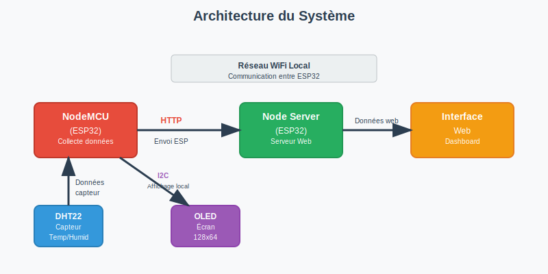
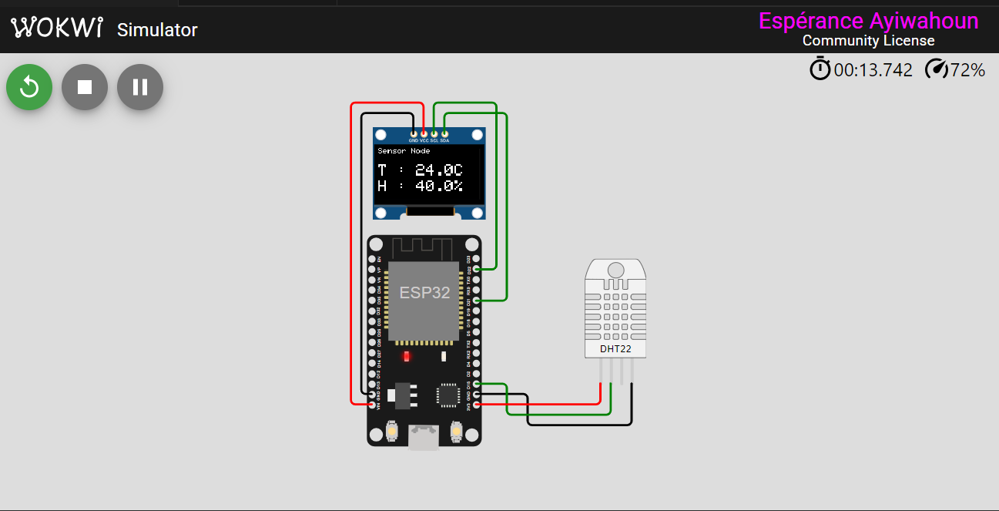

# Smart Multi-Node IoT System avec API REST + Dashboard embarqué

## 🎯 Objectif
Système IoT distribué avec nœuds capteurs ESP32 et dashboard web embarqué, entièrement simulé sur Wokwi.

## 🏗️ Architecture

### Schéma global du système



Le système se compose de deux nœuds ESP32 communiquant en réseau local:
- **Nœud capteur**: Collecte les données environnementales via DHT22 et les transmet
- **Nœud serveur**: Reçoit, traite les données et héberge le dashboard web

Cette architecture distribuée permet une séparation claire des responsabilités: acquisition vs traitement/visualisation.

## 🚀 Démo Wokwi
**Démo du projet:**

[](https://wokwi.com/projects/431738641565850625)

👉 [**Cliquez ici**](https://wokwi.com/projects/431738641565850625) pour accéder à la simulation complète sur Wokwi

## 📁 Structure du projet

```
smart-multinode-iot/
├── capteur-sim-wokwi/          # Nœud capteur avec simulation complète
│   ├── main.ino                # Code principal capteur
│   └── README.md               # Documentation capteur
├── server-logic/              # Nœud central et serveur web
│   ├── main.ino                # Code principal serveur
│   └── web/                    # Interface web embarquée
│       ├── index.html          # Dashboard principal
│       └── script.js           # Logique JavaScript
├── docs/                       # Documentation technique
│   ├── architecture.svg        # Schéma d'architecture
│   ├── simulation.png         # Capture d'écran de la simulation
│   ├── interface.png          # Capture d'écran de l'interface
│   └── notes.md               # Notes techniques détaillées
├── wokwi-diagram.json         # Configuration Wokwi
├── README.md                  # Ce fichier
└── LICENSE                    # Licence MIT
```

## 🔧 Fonctionnalités implémentées

### Nœud Capteur (ESP32 #1)
- ✅ Lecture capteur DHT22 (température/humidité)
- ✅ Affichage OLED temps réel
- ✅ Formation JSON structuré des données
- ✅ Simulation HTTP POST réaliste
- ✅ Gestion non-bloquante avec millis()
- ✅ Écran de démarrage avec messages
- ✅ Gestion d'erreurs capteur

### Nœud Central (ESP32 #2)
- ✅ Réception et traitement données simulées
- ✅ Calculs statistiques avancés (min/max/moyenne)
- ✅ Serveur web embarqué complet
- ✅ API REST complète (/api/data, /api/stats, /api/status)
- ✅ Dashboard responsive sans dépendances externes
- ✅ Stockage en mémoire optimisé
- ✅ Gestion d'état des capteurs (actif/inactif)

### Dashboard Web Embarqué
- ✅ Interface moderne et responsive
- ✅ Graphiques temps réel avec Canvas
- ✅ Alertes température/humidité
- ✅ Historique des mesures
- ✅ Mise à jour automatique
- ✅ Indicateurs visuels d'état
- ✅ Statistiques complètes

## 🛠️ Technologies utilisées

- **Hardware:** ESP32, DHT22, OLED SSD1306
- **Software:** Arduino C++, WebServer ESP32, JSON natif
- **Frontend:** HTML5, CSS3, JavaScript Vanilla
- **Protocoles:** HTTP REST, JSON
- **Simulation:** Wokwi.com

## 📊 Spécifications techniques

- **Fréquence acquisition:** 2 secondes (configurable)
- **Format données:** JSON standardisé
- **Protocole:** HTTP POST/GET
- **Stockage:** Mémoire tampon circulaire
- **Interface:** Dashboard temps réel 100% embarqué
- **Réseau:** Point d'accès WiFi local (pas d'Internet)

## 🚀 Installation et utilisation

### Option 1: Simulation Wokwi (Recommandée)
1. Ouvrir le lien Wokwi fourni
2. Cliquer sur "Start simulation"
3. Observer les données sur l'OLED du capteur
4. Accéder au dashboard via l'IP simulée

### Option 2: Hardware réel
1. Télécharger le code depuis GitHub
2. Flasher `capteur-sim-wokwi/main.ino` sur ESP32 #1
3. Flasher `serveur-logic/main.ino` sur ESP32 #2
4. Connecter les composants selon le schéma
5. Accéder au dashboard via IP ESP32

## 🔒 Conformité aux exigences

- ✅ **Arduino C++ uniquement** - Aucune bibliothèque externe non autorisée
- ✅ **Sans accès Internet** - Fonctionnement 100% local
- ✅ **Gestion non-bloquante** - millis() au lieu de delay()
- ✅ **Dashboard embarqué** - SPIFFS simulé, pas de CDN
- ✅ **Optimisation mémoire** - char[] préférés aux String dynamiques
- ✅ **Architecture modulaire** - Code bien structuré et documenté

## 📈 Fonctionnalités bonus implémentées

- 🎨 **Interface utilisateur moderne** avec design épuré
- 📊 **Graphiques temps réel** avec historique
- 🔔 **Système d'alertes** configurable
- 📱 **Design responsive** pour mobile/desktop
- 🛡️ **Gestion d'erreurs robuste** avec retry automatique
- 📡 **API REST complète** avec endpoints multiples
- 💾 **Optimisation mémoire** avec buffer circulaire
- 🎯 **Configuration dynamique** des seuils

## 👨‍💻 Auteur
Développé dans le cadre du test technique IoT - Recrutement

## 📄 Licence
MIT License - Voir fichier LICENSE pour détails